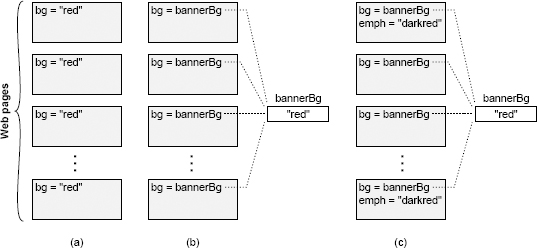

# 第二章 复杂度的本质

这本书是关于如何设计软件系统并尽可能降低其复杂度。第一步是去了解敌人。究竟什么是“复杂度”？如何判断一个系统是否不必要的复杂？什么导致系统变得复杂？本章将在较高层次上讨论这些问题；后续章节将展示如何在较低层次上根据特定的结构特征来识别复杂度。

识别复杂度的能力是一项极为重要的设计技能。它可以让你在投入大量工作量之前识别问题，并使你可以在替代方案中做出好的选择。判断一个设计是否简单比创建一个简单的设计更容易，但当你可以辨别出一个系统太复杂，你的设计哲学就可以在这种能力的指引下趋向简单。如果一个设计看起来很复杂，尝试一个不同的方法并看看这是否简单点。随着时间的推移，你会察觉到某些技术会使设计更简单，而其他的与复杂度相关。这将使你能够更快速地做更简单的设计。

本章还列出了一些基本假设，为本书的其余部分提供基础。后面的章节将本章的材料作为假设事实，并用其来论证各种改进和推论。

## 2.1 复杂度的定义

出于本书的目的，我以实用的方式定义“复杂度”。**复杂度是与软件系统结构相关使其难以理解和修改的任何东西**。复杂度可以有多种形式。例如，它可能是很难理解一段代码是如何运转的；可能是做了大量的努力才实现一个小小地改进；或者可能是不清楚修改系统的哪部分才能获得改进；可能是很难不引入其他问题的情况下修复一个缺陷。如果一个系统很难理解和修改，那么它是复杂的；如果它很容易理解和修改，那么它是简单的。

你也可以从成本与收益的角度来思考复杂度。在一个复杂的系统中，即使很小的改进也需要很大的工作量。在一个简单的系统中，可以较少的投入来实现较大的改进。

复杂度是程序员在努力实现特定目标时在某一特定点的感受。它不一定与系统的整体大小或功能性有关。人们经常用“复杂”这个词来描述具有复杂特性的大型系统，但如果这样的系统很易对其工作，那么就本书而言，它并不是复杂。当然，几乎所有大型且复杂的软件系统实际上很难对其工作，所以它们也符合我对复杂度的定义，但不一定是这样。一个小而基本的系统也可能非常的复杂。

复杂度由最常见的活动决定。如果一个系统有一些非常复杂的部分，但是这些部分几乎不需要接触，那么它们对系统的整体复杂度没有太大影响。用简略的数学方式来描述：

$$
C=\sum_{p}c_pt_p
$$

The overall complexity of a system (C) is determined by the complexity of each part p (cp) weighted by the fraction of time developers spend working on that part (tp). Isolating complexity in a place where it will never be seen is almost as good as eliminating the complexity entirely.

Complexity is more apparent to readers than writers. If you write a piece of code and it seems simple to you, but other people think it is complex, then it is complex. When you find yourself in situations like this, it’s worth probing the other developers to find out why the code seems complex to them; there are probably some interesting lessons to learn from the disconnect between your opinion and theirs. Your job as a developer is not just to create code that you can work with easily, but to create code that others can also work with easily.

## 2.2 Symptoms of complexity

Complexity manifests itself in three general ways, which are described in the paragraphs below. Each of these manifestations makes it harder to carry out development tasks.

**Change amplification**: The first symptom of complexity is that a seemingly simple change requires code modifications in many different places. For example, consider a Web site containing several pages, each of which displays a banner with a background color. In many early Web sites, the color was specified explicitly on each page, as shown in Figure 2.1(a). In order to change the background for such a Web site, a developer might have to modify every existing page by hand; this would be nearly impossible for a large site with thousands of pages. Fortunately, modern Web sites use an approach like that in Figure 2.1(b), where the banner color is specified once in a central place, and all of the individual pages reference that shared value. With this approach, the banner color of the entire Web site can be changed with a single modification. One of the goals of good design is to reduce the amount of code that is affected by each design decision, so design changes don’t require very many code modifications.

**Cognitive load**: The second symptom of complexity is cognitive load, which refers to how much a developer needs to know in order to complete a task. A higher cognitive load means that developers have to spend more time learning the required information, and there is a greater risk of bugs because they have missed something important. For example, suppose a function in C allocates memory, returns a pointer to that memory, and assumes that the caller will free the memory. This adds to the cognitive load of developers using the function; if a developer fails to free the memory, there will be a memory leak. If the system can be restructured so that the caller doesn’t need to worry about freeing the memory (the same module that allocates the memory also takes responsibility for freeing it), it will reduce the cognitive load. Cognitive load arises in many ways, such as APIs with many methods, global variables, inconsistencies, and dependencies between modules.

System designers sometimes assume that complexity can be measured by lines of code. They assume that if one implementation is shorter than another, then it must be simpler; if it only takes a few lines of code to make a change, then the change must be easy. However, this view ignores the costs associated with cognitive load. I have seen frameworks that allowed applications to be written with only a few lines of code, but it was extremely difficult to figure out what those lines were. **Sometimes an approach that requires more lines of code is actually simpler, because it reduces cognitive load.**

Figure 2.1: Each page in a Web site displays a colored banner. In (a) the background color for the banner is specified explicitly in each page. In (b) a shared variable holds the background color and each page references that variable. In (c) some pages display an additional color for emphasis, which is a darker shade of the banner background color; if the background color changes, the emphasis color must also change.

**Unknown unknowns**: The third symptom of complexity is that it is not obvious which pieces of code must be modified to complete a task, or what information a developer must have to carry out the task successfully. Figure 2.1(c) illustrates this problem. The Web site uses a central variable to determine the banner background color, so it appears to be easy to change. However, a few Web pages use a darker shade of the background color for emphasis, and that darker color is specified explicitly in the individual pages. If the background color changes, then the the emphasis color must change to match. Unfortunately, developers are unlikely to realize this, so they may change the central bannerBg variable without updating the emphasis color. Even if a developer is aware of the problem, it won’t be obvious which pages use the emphasis color, so the developer may have to search every page in the Web site.

Of the three manifestations of complexity, unknown unknowns are the worst. An unknown unknown means that there is something you need to know, but there is no way for you to find out what it is, or even whether there is an issue. You won’t find out about it until bugs appear after you make a change. Change amplification is annoying, but as long as it is clear which code needs to be modified, the system will work once the change has been completed. Similarly, a high cognitive load will increase the cost of a change, but if it is clear which information to read, the change is still likely to be correct. With unknown unknowns, it is unclear what to do or whether a proposed solution will even work. The only way to be certain is to read every line of code in the system, which is impossible for systems of any size. Even this may not be sufficient, because a change may depend on a subtle design decision that was never documented.

One of the most important goals of good design is for a system to be obvious. This is the opposite of high cognitive load and unknown unknowns. In an obvious system, a developer can quickly understand how the existing code works and what is required to make a change. An obvious system is one where a developer can make a quick guess about what to do, without thinking very hard, and yet be confident that the guess is correct. Chapter 18 discusses techniques for making code more obvious.

## 2.3 Causes of complexity

Now that you know the high-level symptoms of complexity and why complexity makes software development difficult, the next step is to understand what causes complexity, so that we can design systems to avoid the problems. Complexity is caused by two things: dependencies and obscurity. This section discusses these factors at a high level; subsequent chapters will discuss how they relate to lower-level design decisions.

For the purposes of this book, a dependency exists when a given piece of code cannot be understood and modified in isolation; the code relates in some way to other code, and the other code must be considered and/or modified if the given code is changed. In the Web site example of Figure 2.1(a), the background color creates dependencies between all of the pages. All of the pages need to have the same background, so if the background is changed for one page, then it must be changed for all of them. Another example of dependencies occurs in network protocols. Typically there is separate code for the sender and receiver for the protocol, but they must each conform to the protocol; changing the code for the sender almost always requires corresponding changes at the receiver, and vice versa. The signature of a method creates a dependency between the implementation of that method and the code that invokes it: if a new parameter is added to a method, all of the invocations of that method must be modified to specify that parameter.

Dependencies are a fundamental part of software and can’t be completely eliminated. In fact, we intentionally introduce dependencies as part of the software design process. Every time you write a new class you create dependencies around the API for that class. However, one of the goals of software design is to reduce the number of dependencies and to make the dependencies that remain as simple and obvious as possible.

Consider the Web site example. In the old Web site with the background specified separately on each page, all of the Web pages were dependent on each other. The new Web site fixed this problem by specifying the background color in a central place and providing an API that individual pages use to retrieve that color when they are rendered. The new Web site eliminated the dependency between the pages, but it created a new dependency around the API for retrieving the background color. Fortunately, the new dependency is more obvious: it is clear that each individual Web page depends on the bannerBg color, and a developer can easily find all the places where the variable is used by searching for its name. Furthermore, compilers help to manage API dependencies: if the name of the shared variable changes, compilation errors will occur in any code that still uses the old name. The new Web site replaced a nonobvious and difficult-to-manage dependency with a simpler and more obvious one.

The second cause of complexity is obscurity. Obscurity occurs when important information is not obvious. A simple example is a variable name that is so generic that it doesn’t carry much useful information (e.g., time). Or, the documentation for a variable might not specify its units, so the only way to find out is to scan code for places where the variable is used. Obscurity is often associated with dependencies, where it is not obvious that a dependency exists. For example, if a new error status is added to a system, it may be necessary to add an entry to a table holding string messages for each status, but the existence of the message table might not be obvious to a programmer looking at the status declaration. Inconsistency is also a major contributor to obscurity: if the same variable name is used for two different purposes, it won’t be obvious to developer which of these purposes a particular variable serves.

In many cases, obscurity comes about because of inadequate documentation; Chapter 13 deals with this topic. However, obscurity is also a design issue. If a system has a clean and obvious design, then it will need less documentation. The need for extensive documentation is often a red flag that the design isn’t quite right. The best way to reduce obscurity is by simplifying the system design.

Together, dependencies and obscurity account for the three manifestations of complexity described in Section 2.2. Dependencies lead to change amplification and a high cognitive load. Obscurity creates unknown unknowns, and also contributes to cognitive load. If we can find design techniques that minimize dependencies and obscurity, then we can reduce the complexity of software.

## 2.4 Complexity is incremental

Complexity isn’t caused by a single catastrophic error; it accumulates in lots of small chunks. A single dependency or obscurity, by itself, is unlikely to affect significantly the maintainability of a software system. Complexity comes about because hundreds or thousands of small dependencies and obscurities build up over time. Eventually, there are so many of these small issues that every possible change to the system is affected by several of them.

The incremental nature of complexity makes it hard to control. It’s easy to convince yourself that a little bit of complexity introduced by your current change is no big deal. However, if every developer takes this approach for every change, complexity accumulates rapidly. Once complexity has accumulated, it is hard to eliminate, since fixing a single dependency or obscurity will not, by itself, make a big difference. In order to slow the growth of complexity, you must adopt a “zero tolerance” philosophy, as discussed in Chapter 3.

## 2.5 Conclusion

Complexity comes from an accumulation of dependencies and obscurities. As complexity increases, it leads to change amplification, a high cognitive load, and unknown unknowns. As a result, it takes more code modifications to implement each new feature. In addition, developers spend more time acquiring enough information to make the change safely and, in the worst case, they can’t even find all the information they need. The bottom line is that complexity makes it difficult and risky to modify an existing code base.
