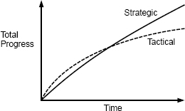

# 第三章 可运行的代码是不够的
（战略与战术编程）

优秀软件设计最有价值的要素之一是你在处理编程任务时采用的思维模式。许多团队鼓励战术思维，专注于使特性尽快运行。然而，如果你想要一个优秀的设计，那么你必须采取更具战略性的方法投入时间来产出干净的设计和解决问题。本章讨论了为什么战略方法产出更优秀的设计，且从长远来看实际比战术方法更便宜。

## 3.1 战术编程

大多数程序员用我称之为战术编程的思维模式来进行软件开发。在战术方法中，你主要关注点是使它运行起来，比如一个新特性或一个问题修复。乍一看这似乎完全合理：还有什么比编写可运行的代码更有价值的呢？然而，战术编程几乎不可能产出优秀的系统设计。

战术编程的问题在于它是短视的。如果你是战术编程，那么你是在努力尽快完成任务。大概你有一个最迟完成时间。因此，前瞻规划并不是当务之急。你不会花太多时间寻找最好的设计；你只是想使它很快运行起来。你告诉自己如果可以更快地完成当前的任务增加一点复杂度或引入一两个小不足也是可以接受的。

这就是系统变复杂的原因。如上一章所讨论的，复杂度是递增的。不是特定的一件事情使得一个系统变复杂，而是几十个或几百个小事的累积。如果你以战术观点进行编程，每个编程任务都会带来一些复杂度。它们每一个多半看起来都像是一个为了迅速完成当前任务的合理折中方案。可是复杂度迅速累积，尤其是如果每个人都以战术观点进行编程。

很快其中一些的复杂度将开始引发问题，然后你将开始希望你没有采用这些早期的捷径。但你会告诉自己，让下一个特性运行起来比返回重构现有代码更重要。重构对长期可能会有帮助，但它肯定会减缓当前任务。因此你寻找快速补丁来应付遇到的任何问题。这只会造成更高的复杂度，然后需要更多的补丁。很快代码就变得一团糟，可当前的糟糕需要花费数月的时间来清理。你的时间表不可能容许此类的延迟，而且解决一两个问题似乎不会有太大的区别，所以你就继续保持战术编程。

如果你已经在一个大型软件项目上工作了很长时间，我觉得你已经在工作中见到了战术编程，并经历了由此产生的问题。一旦你开始走战术路线，就很难改变。

几乎每个软件开发组织中都至少有一个开发人员将战术编程发挥到极致：战术龙卷风。战术龙卷风是一位多产的程序员，他输出代码比其他人快得多但完全以战术性方式。在实现一个紧急特性时，没有人能比战术龙卷风更快。在一些组织中，管理层将战术龙卷风视为英雄。然而，战术龙卷风播下了毁坏之种。他们很少被将来必须使用他们代码的工程师认为是英雄。通常其他工程师必须清理战术龙卷风留下的凌乱不堪，这使得这些工程师（真正的英雄）与战术龙卷风相比进度较慢。

## 3.2 战略编程

成为一名优秀的软件设计师的第一步是意识到**可运行的代码是不够的**。为了更快地完成当前任务引入不必要的复杂度是不可接受的。系统的长远架构是最重要的。系统中的大部分代码是通过扩展现有代码库来编写，所以作为开发人员最重要的工作是使未来扩展更容易。因此，代码可运行理所当然，不应该将“可运行的代码”作为主要目标。主要目标应是输出一个美妙的设计，水到渠成。这是战略编程。

战略编程需要一种投资心态。你必须投入时间来改进系统的设计，而不是走最快的路径来完成当前的项目。这些投资在短期内会使你稍稍减缓速度，但从长远来看它们会使速度加快，如图3.1所示。

投资中的一些是主动的。例如，值得花一点额外的时间为每个新类找到一个简单的设计；而不是先实现脑中浮现的第一个想法，再尝试几种替代设计然后选择最简洁的一个。试想在未来可能更改系统的几种方式，并确保在你的设计下讲会很容易地实现。编写优质的文档是主动投资的另一个例子。

其他投资将是被动的。无论你预先投入多少，你的设计决策都不可避免地会出现错误。随着时间的推移，这些错误会显现出来。当发现一个设计问题时，不要只是忽略或打补丁；多花一点额外的时间修复它。如果你战略编程，你会持续对系统设计做小改进。这与战术编程相反，不断增加小的复杂度，在未来会导致问题。

## 3.3 投资多少

那么，合适的投资额是多少？巨大的前期投入，比如试图设计整个系统，将收效甚微。这是瀑布方法，我们知道这种方法效果欠佳。随着对系统越来越深入的了解，理想的设计纷至沓来。所以，最好的方法持续做多次小额投资。我建议花费总开发时间的10-20%在投资上。这个投入量很小，不会显著影响计划，但随着日积月累会收益颇丰。这样初始项目会比纯战术方法多花费10-20%的时间。多付出的时间将带来更好的软件设计，你会在随后几个月内开始体验到这些好处。不久你的开发速度比用战术编程快最少10-20%。这时你的投资变得绰有余裕：从过去投资获得的收益将节省足够的时间来覆盖未来投资的成本。你将迅速的收回初始投资成本。图3.1说明了这种现象。

图3.1: 在初期战术性方法去编程会比战略性方法更快地取得进展。然而，在战术性方法下复杂度累积地更迅速，从而降低了生产效率。随着时间的推移，战略方法会取得更大的进展。注意：此图仅用于定性说明；我不知道如何实验测量曲线的精确形状。

与之相反，如果你采用战术编程，首期项目完成速度会快10-20%，但是随着时间的推移，你的开发速度将会因复杂度的累积而放缓。不久你的编程速度会至少变慢10-20%。你会很快退还在初期节省的所有时间，并且在系统的剩余周期中你的开发速度会比采用战略方法更慢。如果你从未在一个严重劣化的代码库中工作过，请与有过的人交流；他们会告诉你代码质量粗劣会降低开发速度至少20%。

## 3.4 创业与投资

在某些环境下，有强大的力量与战略方法背道而驰。例如，成长期初创公司迫于巨大的压力使他们要迅速推出早期版本。对于这些公司，即使是10-20%的投资也是负担不起的。因此，许多初创公司采用了战术性的方法，在设计上花费很少精力，甚至在清理冒出的问题上花费更少。他们这样解释，如果创业成功了，他们就有足够的钱聘用更多的工程师来清理干净。
 如果你在一家趋于这个方向的公司，则应该意识到一旦代码库乱作一团意大利面，几乎是不可能修复的。你很可能会为产品的可维护性付出高昂的开发成本。此外，好的（或坏的）设计效果会很快显现，那么战术方法很有可能甚至不能加快产品的首次发布。

另外要思考一个公司成功的最重要的因素之一是工程师的素质。降低开发成本的最佳方法是聘请优秀的工程师：他们的成本并不比普通的工程师高很多，但生产率却高得非常多。然而，优秀的工程师非常在意良好的设计。如果代码库分崩离析，消息会不胫而走，于是会更难招募。最终可能只招募到普通工程师。这会增加预计成本，并可能导致系统架构进一步劣化。

脸书是一个创业公司鼓励战术编程的例子。公司的信条曾是“大干快上，摧枯拉朽”很多年。鼓励刚大学毕业的新工程师立即深入参与代码开发；上岗的第一周就推送代码至生产是很普遍的。从积极的方面来看，脸书作为一家赋予员工权力的公司而享有盛誉。工程师拥有极大的自由度，并且几乎没有规则和限制来阻碍他们。

脸书作为一家公司取得了惊人的成功，但由于公司推崇战术方法其代码库遭受劣化；大量代码不稳定且难以理解，几乎没有注释或测试，使用起来很痛苦。一段时间后公司意识到这种文化是不可持续的。最终，脸书把信条更换为“固若金汤，大干快上”以鼓励工程师在好的设计上投入更多。脸书是否能成功清理多年战术编程累积的问题还有待观察。

公平地说，我应该指明脸书的代码并不比初创公司的平均水平差很多。战术编程在初创公司中司空见惯；脸书恰好是一个特别明显的例子。

幸运地是通过战略方法在硅谷同样可能取得成功。谷歌和威睿与脸书同时期成长，但这两家公司都采用了更具战略性的方法。这两家公司都非常重视高质量的代码和良好的设计，且两家公司都构建出了尖端的产品，通过可靠的软件系统解决复杂问题。这些公司的卓越技术文化在硅谷变得广为人知。很有有其他公司能与他们聘请顶级技术人才。

这些例子表明，公司可以通过任何一种方法取得成功。但在一家关心在意软件设计并拥有整洁代码库的公司工作会更愉悦。

## 3.5 结论

好的设计并不免费。它需要持续不断的投资，这样才不会积羽沉舟。幸运地是，好的设计最终会收回它自己的成本，且比想象的要快。

至关重要的是，始终如一地采用战略方法且把投资作为立刻要做的事而不拖延至明天。当你处于紧缩状态时，很容易将清理工作推迟至紧缩结束之后。然而，这是一个湿滑的斜坡；在当前的紧缩之后几乎肯定会另一个滑坡，在那个之后还会有下一个。一旦你开始推迟对设计的改进，很容易把推迟永久化，文化也很容易陷入战术方法中。设计问题拖延的时间越长，它们就会变得越大；解决方案变得愈发令人生畏，这又使它们更容易被拖延。最有效的方法是每个工程师都为好的设计持续投入少量的精力。